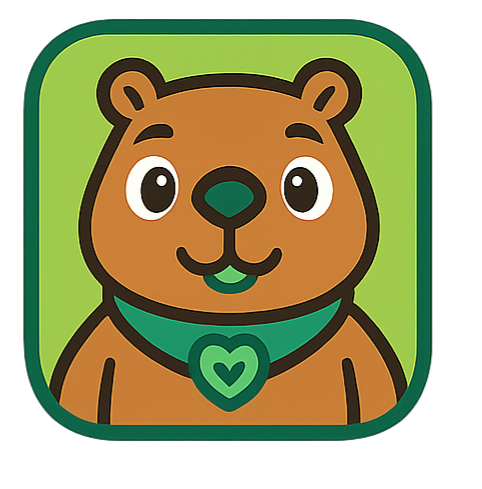

<div align="center">
  

  # LifeCity

  **Rede social cívica para registrar problemas urbanos**

  [](https://flutter.dev)
  [](https://nodejs.org)
  [](https://supabase.com)

  *Trabalho de Conclusão de Curso — Engenharia de Software — PUC-Campinas 2026*
</div>

---

## Sobre o projeto

O **LifeCity** é um aplicativo mobile que conecta moradores e poder público, permitindo que cidadãos registrem problemas urbanos geolocalizados em um mapa interativo, engajem a comunidade por meio de gamificação e colaborem em equipes para resolver desafios da cidade.

## Stack

| Camada | Tecnologia |
|---|---|
| Mobile | Flutter / Dart |
| Backend | Node.js + Express |
| Banco de dados | PostgreSQL (Supabase) |
| Storage | Supabase Storage |
| Autenticação | JWT (access token + refresh token) |
| Mapa | OpenStreetMap via flutter_map |

## Funcionalidades

### Mapa e Reclamações
- Mapa interativo com pins de reclamações e eventos
- Registro de reclamações com foto, categoria e geolocalização (GPS ou manual)
- Filtros por categoria: Infraestrutura, Segurança, Limpeza, Trânsito
- Acompanhamento de status (pendente → resolvido)
- Curtidas, comentários e testemunhos em reclamações

### Social
- Sistema de amizades (adicionar, aceitar, recusar)
- Aba de destaques com top reclamações por engajamento
- Perfil público com card do autor, XP e conquistas em destaque
- Navegação para perfil de outros usuários

### Gamificação
- **XP e Níveis** calculados por engajamento cívico (reclamações, curtidas, comentários)
- **Conquistas** desbloqueadas automaticamente por marcos atingidos (ex.: "Primeira Voz", "Fiscal da Cidade", "Popular")
- Até 3 conquistas em destaque no perfil público
- **Bônus de XP** (`bonus_xp`) concedido via bônus de equipe

### Missões
- Missões **diárias** e **semanais** sorteadas automaticamente do pool de templates
- Progresso calculado em tempo real conforme reclamações são criadas ou resolvidas
- Bônus de XP semanal baseado no desempenho coletivo da equipe
- Aba dedicada com progresso visual (barra de progresso) e chip de bônus

### Equipes
- Criação de equipes permanentes (mín. 2 / máx. 7 membros)
- Convites para amigos via notificação (`team_invite`)
- Painel da equipe com membros, XP total, status e contagem de membros ativos

### Notificações
- Centro de notificações com badge de não lidas
- Tipos: curtida, comentário, pedido de amizade, conquista desbloqueada, missão concluída, convite de equipe

### Conta e Configurações
- Modo claro e modo escuro (alternância nas configurações)
- Edição de perfil (nome, foto, CPF, data de nascimento)
- Alteração de senha e telefone
- Tela "Meus itens" com histórico de reclamações e eventos

## Banco de dados — tabelas principais

| Tabela | Descrição |
|---|---|
| `users` | Usuários cadastrados |
| `complaints` | Reclamações geolocalizadas |
| `events` | Eventos locais |
| `friendships` | Relações de amizade |
| `complaint_likes` | Curtidas em reclamações |
| `complaint_comments` | Comentários em reclamações |
| `complaint_witnesses` | Testemunhos em reclamações |
| `achievements` | Catálogo de conquistas |
| `user_achievements` | Conquistas desbloqueadas por usuário |
| `notifications` | Notificações sociais e de sistema |
| `mission_templates` | Pool de missões gerenciado por admin |
| `user_missions` | Missões atribuídas a cada usuário |
| `teams` | Equipes permanentes |
| `team_members` | Membros das equipes |

## Como rodar

### Backend

```bash
cd backend
npm install
# Crie um .env com: DATABASE_URL, JWT_SECRET, JWT_REFRESH_SECRET, SUPABASE_URL, SUPABASE_SERVICE_KEY
npm run dev
```

O servidor sobe na porta `3000` e aplica todas as migrations automaticamente ao iniciar.

### Flutter

```bash
flutter pub get
# Ajuste a baseUrl em lib/core/services/api_service.dart para apontar ao backend
flutter run
```

## Estrutura do projeto

```
LifeCity/
├── lib/
│   ├── core/
│   │   ├── models/          # Entidades de domínio (Dart)
│   │   ├── services/        # Comunicação com a API REST
│   │   ├── state/           # Providers (auth, theme)
│   │   └── routes/          # Navegação (AppRoutes + RouteGenerator)
│   └── views/
│       ├── map/             # Mapa interativo
│       ├── complaints/      # Reclamações
│       ├── events/          # Eventos
│       ├── profile/         # Perfil e configurações
│       ├── missions/        # Missões e equipes
│       └── social/          # Feed social / destaques
└── backend/
    └── src/
        ├── controllers/     # Lógica de negócio
        ├── routes/          # Endpoints Express
        └── infra/           # Pool de banco, checadores de conquistas e missões
```

## Equipe

| Nome | RA |
|---|---|
| Bernardo Wiemer | 22023125 |
| Lucas Martins Giazzi | 22019941 |
| João Victor Bezerra Batista Rocha | 22020875 |
| Yuri Viegas | 22021857 |

**Orientadora:** Professora Eliane F. Y. de Azevedo

---

<div align="center">
  <sub>PUC-Campinas · Engenharia de Software · 2026</sub>
</div>
