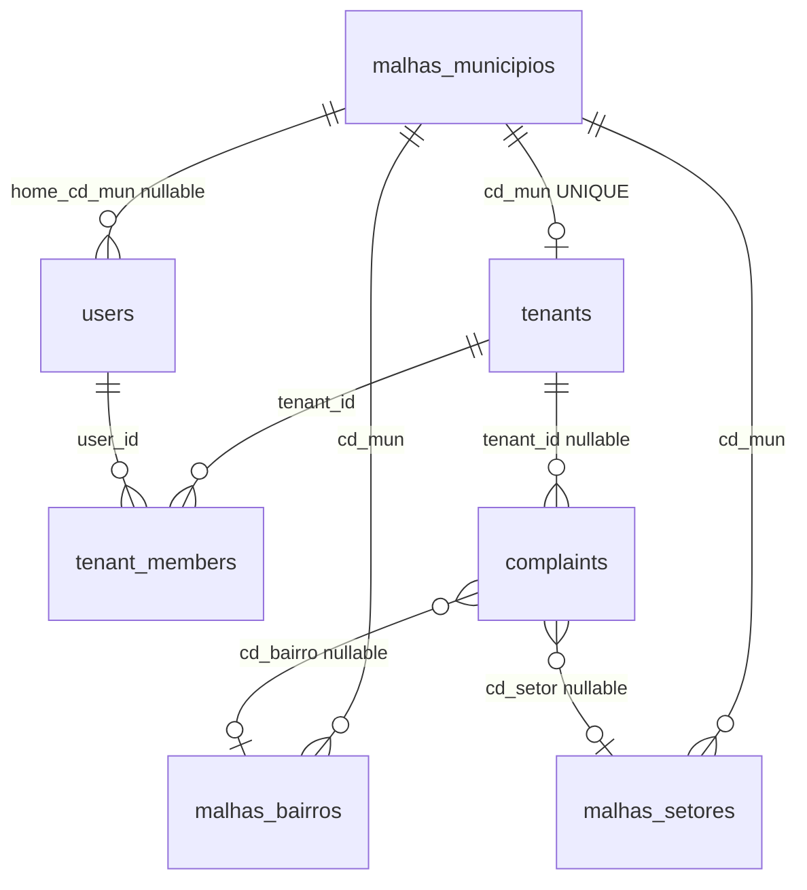

# ADR-001 — Multi-tenant municipal e dashboard administrativo

| Campo | Valor |
|-------|-------|
| **Status** | Proposto |
| **Data** | 2026-06-04 |
| **Decisores** | Equipe LifeCity |
| **Contratos** | [Fase 1](../contracts/phase-1-database.md) · [Fase 2](../contracts/phase-2-admin-web.md) · [Fase 3](../contracts/phase-3-flutter.md) |

---

## 1. Contexto

O **LifeCity** é uma plataforma de gestão e inteligência urbana para prefeituras. Cidadãos registram ocorrências geolocalizadas via app Flutter; prefeituras precisam de um ambiente isolado por município (multi-tenant) com dashboard web.

### Estado atual (inventário — jun/2026)

| Camada | Situação |
|--------|----------|
| **App Flutter** | Funcional: cadastro, login JWT, reclamações com foto e geolocalização (lat/lng text). Sem vínculo municipal. |
| **Backend Node/Express** | Auth customizado (`/api/auth/*`), complaints/events sem escopo tenant. JWT carrega apenas `userId`. |
| **admin-web (React/Vite)** | Login semi-implementado (`user_level > 1`). Dashboard placeholder. Sem mapa, sem tenant. |
| **Supabase/Postgres** | PostGIS 3.3.7. Schema `malhas`: 645 municípios SP, ~2.170 bairros (58 municípios), setores vazios. Schema `public`: users, complaints, gamificação — single-tenant. |

### Problema

Não existe isolamento por município. Um servidor municipal não tem ambiente próprio; cidadãos não são vinculados à cidade; reclamações são globais. O painel admin não exibe inteligência territorial.

### Restrição crítica de rollout

**O app Flutter deve continuar funcionando sem alterações durante as Fases 1 e 2.** Mudanças no banco devem ser aditivas e retrocompatíveis (colunas nullable, APIs existentes preservadas). Alterações no app ficam exclusivamente na **Fase 3**.

---

## 2. Objetivos

1. Estabelecer multi-tenant no banco usando `malhas.municipios` como dimensão geográfica canônica (sem tabela dim duplicada).
2. Entregar dashboard MVP no admin-web: mapa territorial + KPIs + gráficos + rankings.
3. Isolar acesso administrativo por tenant (município contratante).
4. Na fase final, vincular cidadão ao município via validação geográfica no cadastro.

## 3. Não-objetivos (escopo deste ADR)

- Gestão operacional de reclamações (status, workflow, atribuição, SLA, solução) → **ADR futuro**.
- Restringir local de criação de reclamações pelo cidadão → regra de negócio pendente; **fora de escopo**.
- Migração para Supabase Auth nativo.
- Schema por tenant (`tenant_campinas.*`).
- Cobertura geográfica além de SP nesta fase.
- SSO / login gov.br.

---

## 4. Decisões arquiteturais

### D-001 — `malhas.municipios(cd_mun)` é a dimensão municipal

Não criar `public.dim_municipios`. Toda referência municipal usa `cd_mun` char(7) IBGE com FK para `malhas.municipios(cd_mun)`.

**Pré-requisito:** índice `UNIQUE` em `malhas.municipios(cd_mun)` (PK atual é `ogc_fid`).

### D-002 — Separação de schemas

| Schema | Responsabilidade | Mutabilidade |
|--------|------------------|--------------|
| `malhas` | Malhas IBGE: municípios, bairros, setores censitários | Read-mostly (cargas batch) |
| `public` | Dados operacionais: tenants, users, complaints, memberships | Read-write via API |

### D-003 — Tenant operacional ≠ município IBGE (relação 1:1)

`public.tenants` representa o **ambiente contratado** da prefeitura. Relacionamento 1:1 com `cd_mun` nesta fase. Campos extras: `slug`, `status`, `settings` (jsonb).

### D-004 — Dois tipos de usuário

| Tipo | Vínculo | Acesso |
|------|---------|--------|
| **Cidadão** | `users.home_cd_mun` (Fase 3) | App Flutter |
| **Servidor municipal** | `tenant_members` (tenant + role) | admin-web |

`user_level > 1` permanece como fallback legado até deprecação; fonte da verdade de RBAC municipal passa a ser `tenant_members.role`.

### D-005 — Escopo de dados operacionais

Tabelas tenant-scoped recebem `tenant_id uuid FK → tenants.id`. Para joins geográficos, manter também `cd_mun` denormalizado onde útil.

Colunas novas são **nullable** nas Fases 1–2 para não quebrar o app.

### D-006 — Coordenadas: migrar para PostGIS gradualmente

`complaints.latitude/longitude` (text) permanecem na Fase 1–2. Adicionar `complaints.location geometry(Point,4326)` para o dashboard. Backfill assíncrono; APIs Flutter continuam usando lat/lng text.

### D-007 — Tenant context no JWT (Fase 2)

Após login admin, JWT inclui `tenantId`, `cd_mun`, `tenantRole`. Middleware backend valida membership antes de servir dados admin.

Header alternativo `X-Tenant-Id` para switch de tenant (multi-município futuro).

### D-008 — Dashboard: visualização only

Dashboard MVP é **somente leitura analítica**. Sem alteração de status, atribuição ou moderação de reclamações.

---

## 5. Modelo de dados (visão consolidada)



### Tabelas novas (Fase 1)

```sql
-- tenants: ambiente da prefeitura
public.tenants (
  id uuid PK,
  cd_mun char(7) UNIQUE NOT NULL → malhas.municipios(cd_mun),
  slug text UNIQUE NOT NULL,
  display_name text NOT NULL,
  status text CHECK (trial|active|suspended),
  settings jsonb DEFAULT '{}',
  activated_at timestamptz,
  created_at timestamptz
)

-- tenant_members: servidores do painel
public.tenant_members (
  id uuid PK,
  tenant_id uuid → tenants.id,
  user_id uuid → users.id,
  role tenant_role ENUM (owner|admin|operator|viewer),
  is_active boolean,
  UNIQUE (tenant_id, user_id)
)
```

### Alterações aditivas (Fase 1 — nullable)

```sql
-- users (Fase 3 tornará home_cd_mun NOT NULL para cidadãos)
ALTER users ADD home_cd_mun char(7) → malhas.municipios;
ALTER users ADD address_confirmed_at timestamptz;
ALTER users ADD registration_address text;

-- complaints (backfill pelo dashboard; app ignora)
ALTER complaints ADD tenant_id uuid → tenants;
ALTER complaints ADD cd_mun char(7) → malhas.municipios;
ALTER complaints ADD cd_setor varchar → malhas.setores;
ALTER complaints ADD cd_bairro varchar;
ALTER complaints ADD location geometry(Point,4326);
```

### Funções auxiliares (Fase 1)

| Função | Propósito |
|--------|-----------|
| `geo.resolve_cd_mun(point)` | Retorna `cd_mun` via `ST_Contains` em `malhas.municipios` |
| `geo.resolve_cd_bairro(point, cd_mun)` | Lookup espacial em `malhas.bairros` |
| `geo.resolve_cd_setor(point, cd_mun)` | Lookup espacial em `malhas.setores` |
| `geo.point_from_latlng(text, text)` | Converte lat/lng text → geometry |

Schema sugerido: `geo` (funções STABLE/IMMUTABLE, security definer se necessário).

---

## 6. Fases de implementação

```
Fase 1 ──► Fase 2 ──► Fase 3
  DB         admin-web    Flutter
  │              │            │
  │              │            └─ Cadastro com ST_Within + Nominatim
  │              └─ Dashboard MVP + APIs admin + tenant JWT
  └─ Schema multi-tenant aditivo (app intacto)
```

| Fase | Nome | App Flutter | Contrato |
|------|------|-------------|----------|
| **1** | Fundação multi-tenant (DB) | ✅ Sem mudanças | [phase-1-database.md](../contracts/phase-1-database.md) |
| **2** | Painel admin MVP | ✅ Sem mudanças | [phase-2-admin-web.md](../contracts/phase-2-admin-web.md) |
| **3** | Cadastro municipal cidadão | 🔄 Alterado | [phase-3-flutter.md](../contracts/phase-3-flutter.md) |

### Fase 1 — Fundação multi-tenant (banco)

**Entrega:** migrations SQL revisáveis; seed tenant Campinas (`3509502`); funções geo; backfill opcional de `complaints.location` e `tenant_id`; **zero breaking change** nas APIs existentes.

### Fase 2 — Painel admin MVP

**Entrega:** APIs `/api/admin/*` tenant-scoped; login com tenant context; dashboard split-view:

| Metade esquerda (mapa) | Metade direita (analytics) |
|------------------------|----------------------------|
| Malha municipal (default) | Cards KPI (total, pendentes, últimos 7d, categorias) |
| Points de reclamações | Gráfico distribuição por categoria |
| Toggle malha bairros | Ranking top setores/bairros |
| Toggle malha setores | Área reservada para expansão |

**Stack mapa recomendada:** Leaflet + react-leaflet (consistente com flutter_map/OSM no app).

### Fase 3 — Cadastro municipal (Flutter)

**Entrega:** fluxo pós-formulário de cadastro:

1. Obter localização do dispositivo (Geolocator — já usado no app).
2. Backend valida `ST_Within(point, malhas.municipios.geometry)`.
3. Tela: *"Identificamos que você está em {cidade}! Confirme sua localização:"*
4. Endereço autocompletado via Nominatim reverse geocoding (já implementado em `create_complaint_page.dart`).
5. Usuário confirma → persiste `home_cd_mun`, `registration_address`, `address_confirmed_at`.
6. **Reclamações:** sem restrição geográfica nesta fase.

---

## 7. Segurança e RLS

Estado atual: **16 tabelas `public` com RLS desabilitado** (alerta Supabase MCP).

| Fase | Ação |
|------|------|
| 1 | Documentar; não habilitar RLS sem policies (bloquearia tudo) |
| 2 | Isolamento admin via middleware backend + JWT tenant (suficiente para MVP) |
| Futuro | RLS tenant-aware quando/se migrar para Supabase client direto |

**Regra Supabase:** nunca usar `user_metadata` para autorização; claims de tenant vão no JWT assinado pelo backend ou `app_metadata` se migrar auth.

---

## 8. Tenant piloto

| Campo | Valor |
|-------|-------|
| Município | Campinas |
| `cd_mun` | `3509502` |
| `slug` | `campinas` |
| Escopo malhas | SP completo em `malhas.municipios`; bairros/setores conforme carga |

---

## 9. Skills e Cursor Rules

### Rule criada: `.cursor/rules/lifecity-multi-tenant.mdc`

Aplicar **sempre** em sessões de implementação deste ADR. Contém invariantes (retrocompatibilidade Flutter, FK via `cd_mun`, MCP read-only para explore).

**Como usar:** a rule é carregada automaticamente pelo Cursor quando `alwaysApply: true`. Ao iniciar fase, mencionar no prompt: *"Siga ADR-001 e a rule lifecity-multi-tenant"*.

### Skills recomendadas

| Skill | Quando usar |
|-------|-------------|
| `supabase` (plugin) | Migrations, RLS, advisors, PostGIS no Supabase |
| `supabase-postgres-best-practices` | Índices GIST, queries espaciais, performance de agregações |
| `create-rule` | Evoluir rules quando novos padrões emergirem (ex.: ADR de gestão de reclamações) |

### MCP

| Servidor | Uso |
|----------|-----|
| `user-supabase-lifecity` | **Explore:** SELECT, list_tables, get_advisors. **Nunca** DDL/DML pelo MCP — scripts em `backend/migrations/` para revisão humana. |

---

## 10. ADRs futuros (fora deste escopo)

| ADR | Tema |
|-----|------|
| ADR-002 | Gestão operacional de reclamações (workflow, status, responsáveis) |
| ADR-003 | Restrição geográfica na criação de reclamações |
| ADR-004 | RLS completo + Supabase Auth (se aplicável) |

---

## 11. Riscos e mitigações

| Risco | Mitigação |
|-------|-----------|
| Migration quebra app Flutter | Colunas nullable; APIs inalteradas Fase 1–2; testes de regressão API |
| `cd_mun` sem UNIQUE impede FK | Migration dedicada antes de qualquer FK |
| Malhas bairros/setores incompletas | Dashboard funciona com município; rankings parciais com indicador de cobertura |
| JWT sem tenant vaza dados | Middleware rejeita `/api/admin/*` sem tenantId válido |
| `AdminUser.id` tipado como `number` no TS | Corrigir para `string` (uuid) na Fase 2 |

---

## 12. Glossário

| Termo | Definição |
|-------|-----------|
| `cd_mun` | Código IBGE do município (7 dígitos) |
| `tenant` | Ambiente operacional LifeCity de uma prefeitura |
| `malha` | Polígono geográfico IBGE (município, bairro, setor censitário) |
| `home_cd_mun` | Município de residência confirmado do cidadão |

---

## 13. Referências internas

- MER atual: `docs/sections/06_mer.tex`
- Migrations existentes: `backend/migrations/`
- Auth admin: `admin-web/src/auth/`, `backend/src/controllers/authController.js`
- Nominatim no Flutter: `lib/views/complaints/create_complaint_page.dart` (`_reverseGeocode`)
