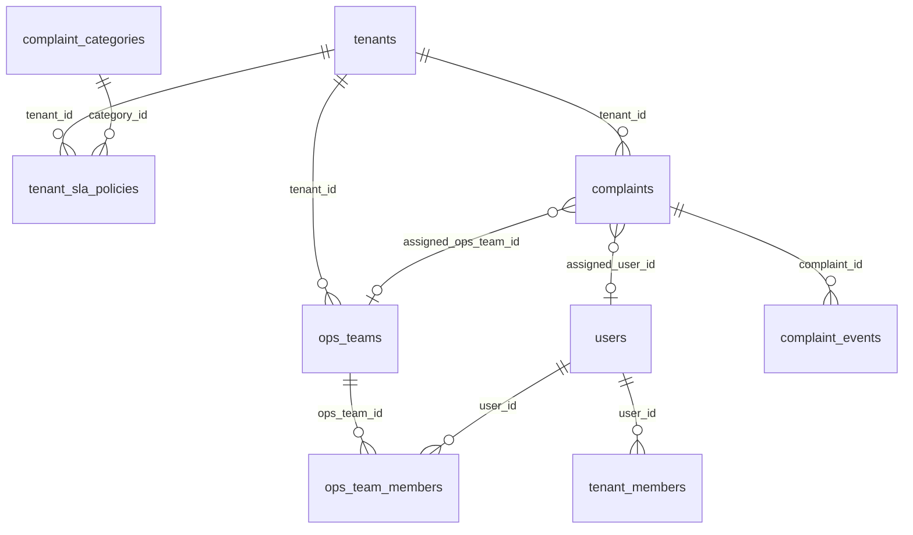

# ADR-003 — Gestão operacional de ocorrências (equipes municipais, workflow e SLA)

| Campo | Valor |
|-------|-------|
| **Status** | Proposto |
| **Data** | 2026-06-07 |
| **Decisores** | Equipe LifeCity |
| **Relacionado** | [ADR-001](ADR-001-multi-tenant-municipal.md) · [ADR-002](ADR-002-complaint-categories.md) |
| **Contrato** | [Fase 4 — Gestão operacional](../contracts/phase-4-operational-management.md) |

---

## 1. Contexto

O **LifeCity** conecta cidadãos (app Flutter) a prefeituras (admin-web). O [ADR-001](ADR-001-multi-tenant-municipal.md) entregou isolamento multi-tenant e dashboard **analítico** (mapa + KPIs). O [ADR-002](ADR-002-complaint-categories.md) centralizou categorias com cor/ícone.

A documentação acadêmica (`docs/sections/`) descreve o ator **Órgão Governamental** e a motivação central: *"concentrar denúncias, solicitações e informações sobre o território, facilitando priorização, planejamento e acompanhamento"*. Hoje o painel **visualiza** ocorrências, mas não permite **operar** sobre elas.

### Estado atual (inventário — jun/2026)

| Camada | Situação |
|--------|----------|
| **admin-web** | Dashboard mapa + analytics; `ComplaintDetailPage` read-only com card "Gestão" placeholder (botões desabilitados). Sidebar: Dashboard + Minha conta. |
| **Backend admin** | `GET /api/admin/complaints`, `GET /api/admin/complaints/:id`, analytics, malhas. **Sem** PATCH/POST operacionais. |
| **Status de ocorrências** | `complaints.status`: `pending` (default), `in_progress`, `resolved`. App Flutter permite ao **cidadão autor** alterar status (`PATCH /api/complaints/:id/status`). Admin-web reconhece também `closed` e `cancelled` na UI, mas não existem no backend admin. |
| **Equipes no banco** | `teams` + `team_members` = **equipes de cidadãos** (gamificação, missões semanais). **Não** representam secretarias/equipes de campo da prefeitura. |
| **RBAC municipal** | `tenant_members.role`: `owner` \| `admin` \| `operator` \| `viewer`. Sem papéis operacionais granulares (ex.: triagem vs. execução). |
| **Moderação** | `reports` (denúncias de conteúdo), `complaints.is_hidden`, `users.is_restricted` — lógica no app, **sem** fila no admin. |
| **Notificações** | Tabela `notifications` pronta; Flutter tem preferência "mudanças de status". Sem emissão automática quando prefeitura altera status. |
| **Territorial** | `complaints` com `tenant_id`, `cd_mun`, `cd_bairro`, `cd_setor`, `location`. Campinas: ~2.592 setores censitários carregados. |
| **Dados piloto** | Tenant `campinas` (`3509502`); 10 ocorrências `pending`; 5 categorias no catálogo. |

### Problema

A prefeitura recebe ocorrências georreferenciadas, mas não tem no LifeCity:

1. **Fila de trabalho** — triagem, priorização, filtros operacionais.
2. **Encaminhamento** — atribuir a secretaria/equipe responsável.
3. **SLA** — prazos por categoria, alertas de vencimento, métricas de cumprimento.
4. **Rastreabilidade** — quem fez o quê, quando (audit trail).
5. **Comunicação estruturada** — notas internas vs. retorno ao cidadão.

Sem isso, o dashboard vira apenas "mapa bonito" e a prefeitura continua usando planilhas, e-mail ou sistemas paralelos.

### Distinção crítica: duas "equipes"

| Conceito | Tabelas atuais | Público | Propósito |
|----------|----------------|---------|-----------|
| **Equipe cidadã** | `teams`, `team_members` | App Flutter | Gamificação, missões colaborativas |
| **Equipe operacional municipal** | *novas tabelas* | admin-web | Resolver ocorrências (Obras, Limpeza, Trânsito…) |

**Nunca reutilizar `teams` para operação municipal** — domínios, permissões e ciclo de vida são distintos.

---

## 2. Objetivos

1. Permitir que servidores municipais **gerenciem o ciclo de vida** das ocorrências do seu tenant.
2. Introduzir **equipes operacionais** configuráveis por prefeitura, com roteamento por categoria e/ou território.
3. Definir **SLA por categoria** (e opcionalmente por prioridade), com indicadores no dashboard.
4. Registrar **histórico imutável** de ações administrativas (audit log).
5. Notificar cidadãos quando a prefeitura alterar status ou registrar resolução.
6. Manter **retrocompatibilidade** com o app Flutter (APIs existentes intactas; novos campos nullable).

## 3. Não-objetivos (escopo deste ADR)

- Integração com ERP/156/gov.br ou sistemas legados da prefeitura.
- App mobile para agentes de campo (futuro).
- CRUD de categorias por tenant (continua global — ADR-002).
- Reutilizar equipes de gamificação (`teams`) para operação.
- Chat direto prefeitura ↔ cidadão.
- Ordem de serviço com materiais, frota ou estoque.
- SSO gov.br.
- Habilitar RLS Supabase (continua via middleware backend — ADR-001).

---

## 4. Personas e necessidades da prefeitura

| Persona | Papel (`tenant_members`) | Necessidade principal |
|---------|--------------------------|------------------------|
| **Gestor municipal** | `owner` / `admin` | Visão macro: SLA, backlog, desempenho por equipe/secretaria, exportação |
| **Coordenador de equipe** | `admin` / `operator` | Fila da sua equipe, reatribuição, notas internas, fechamento |
| **Operador / atendente** | `operator` | Triagem inicial, encaminhar, atualizar status, registrar evidência |
| **Visualizador** | `viewer` | Dashboard e detalhes read-only (já suportado parcialmente) |

Fluxo típico municipal:

```
Cidadão registra → Triagem (prefeitura) → Atribuição automática/manual
    → Em execução → Resolvida (com evidência opcional) → Encerrada
         ↳ Cidadão notificado em cada transição relevante
```

---

## 5. Decisões arquiteturais

### D-001 — Workflow de status municipal estendido

Estados canônicos (máquina finita):

| Status | Significado | Visível ao cidadão |
|--------|-------------|-------------------|
| `pending` | Aguardando triagem | Sim |
| `triaged` | Revisada, aguardando encaminhamento | Sim (como "Em análise") |
| `assigned` | Atribuída a equipe/responsável | Sim |
| `in_progress` | Em execução no terreno | Sim |
| `resolved` | Solução registrada | Sim |
| `closed` | Encerrada (sem pendência) | Sim |
| `cancelled` | Invalidada / duplicata / fora de escopo | Sim (com motivo) |
| `reopened` | Reaberta após `closed`/`resolved` | Sim |

**Migração:** ocorrências existentes permanecem `pending`. O app Flutter continua aceitando `pending` \| `in_progress` \| `resolved` para o **autor**; transições admin usam conjunto completo via `/api/admin/*`.

**Regra:** alterações de status pela prefeitura **sempre** geram registro em `complaint_events` (D-004).

### D-002 — Equipes operacionais municipais (`ops_teams`)

Nova entidade tenant-scoped:

```sql
public.ops_teams (
  id uuid PK,
  tenant_id uuid NOT NULL → tenants.id,
  name varchar(100) NOT NULL,
  slug text NOT NULL,
  description text,
  -- Roteamento default (nullable = qualquer)
  default_category_ids uuid[] DEFAULT '{}',  -- FK lógica → complaint_categories
  default_cd_bairros varchar[] DEFAULT '{}',
  contact_email text,
  is_active boolean DEFAULT true,
  created_at timestamptz DEFAULT now(),
  UNIQUE (tenant_id, slug)
)

public.ops_team_members (
  id uuid PK,
  ops_team_id uuid → ops_teams.id,
  user_id uuid → users.id,  -- deve ter tenant_members ativo
  role ops_team_role ENUM (lead|member),
  is_active boolean DEFAULT true,
  joined_at timestamptz DEFAULT now(),
  UNIQUE (ops_team_id, user_id)
)
```

Seed sugerido para Campinas (exemplo):

| Equipe | Categorias default |
|--------|-------------------|
| Secretaria de Obras | infraestrutura |
| Defesa Civil / Segurança | seguranca |
| Limpeza Urbana | limpeza |
| Trânsito e Mobilidade | transito |

### D-003 — Atribuição de ocorrências

Colunas aditivas em `complaints`:

```sql
ALTER complaints ADD assigned_ops_team_id uuid → ops_teams;
ALTER complaints ADD assigned_user_id uuid → users;  -- responsável individual (opcional)
ALTER complaints ADD assigned_at timestamptz;
ALTER complaints ADD priority smallint DEFAULT 3 CHECK (priority BETWEEN 1 AND 5);
ALTER complaints ADD sla_due_at timestamptz;  -- calculado na triagem/atribuição
ALTER complaints ADD resolved_at timestamptz;
ALTER complaints ADD closed_at timestamptz;
```

**Roteamento automático (MVP):** na triagem, se `assigned_ops_team_id` nulo, resolver equipe pela primeira regra que bater:

1. `complaint_categories.slug` ∈ `ops_teams.default_category_ids` (via join)
2. `cd_bairro` ∈ `ops_teams.default_cd_bairros`
3. Fallback: equipe "Triagem Geral" do tenant

Operador pode **sobrescrever** manualmente.

### D-004 — Audit trail (`complaint_events`)

```sql
public.complaint_events (
  id uuid PK,
  complaint_id bigint → complaints.id,
  tenant_id uuid → tenants.id,
  actor_id uuid → users.id,  -- servidor municipal
  event_type varchar(50) NOT NULL,
  -- status_change | assignment | note | priority_change | sla_breach | moderation
  payload jsonb NOT NULL DEFAULT '{}',
  -- ex.: { "from": "pending", "to": "assigned", "note": "..." }
  is_internal boolean DEFAULT false,  -- true = nota interna, não visível ao cidadão
  created_at timestamptz DEFAULT now()
)
```

Índice: `(complaint_id, created_at DESC)`.

### D-005 — SLA por categoria (`tenant_sla_policies`)

SLA configurável **por tenant** (cada prefeitura define prazos):

```sql
public.tenant_sla_policies (
  id uuid PK,
  tenant_id uuid → tenants.id,
  category_id uuid → complaint_categories.id,
  response_hours integer NOT NULL,   -- 1ª ação (triagem/atribuição)
  resolution_hours integer NOT NULL, -- resolução
  business_hours_only boolean DEFAULT false,
  is_active boolean DEFAULT true,
  UNIQUE (tenant_id, category_id)
)
```

**Cálculo de `sla_due_at`:** na criação ou triagem, `created_at + resolution_hours` (ou política do tenant). Job diário ou query materializada marca `sla_breached` em analytics.

Defaults sugeridos (configuráveis):

| Categoria | Resposta | Resolução |
|-----------|----------|-----------|
| seguranca | 4 h | 24 h |
| infraestrutura | 24 h | 72 h |
| limpeza | 24 h | 48 h |
| transito | 24 h | 72 h |
| outros | 48 h | 120 h |

### D-006 — Permissões operacionais (RBAC estendido)

Matriz mínima:

| Ação | viewer | operator | admin | owner |
|------|--------|----------|-------|-------|
| Ver fila e detalhes | ✓ | ✓ | ✓ | ✓ |
| Alterar status | — | ✓ | ✓ | ✓ |
| Atribuir equipe | — | ✓ | ✓ | ✓ |
| Nota interna | — | ✓ | ✓ | ✓ |
| Configurar SLA / equipes | — | — | ✓ | ✓ |
| Moderação (ocultar) | — | — | ✓ | ✓ |

Operadores veem por padrão ocorrências **da sua equipe** ou **não atribuídas**; admins veem tudo do tenant.

Middleware: `requireTenantRole('operator')` para rotas mutáveis.

### D-007 — Notificações ao cidadão

Ao transicionar status via admin (exceto notas internas):

```sql
INSERT INTO notifications (user_id, actor_id, type, reference_type, reference_id)
VALUES (complaint.created_by, admin_user_id, 'complaint_status', 'complaint', complaint.id);
```

Payload amigável derivado do status (Flutter já tem preferência de notificação de status).

**Não** expor dados internos (notas, nome do servidor) na notificação.

### D-008 — Moderação integrada ao admin

Fila read-only inicial em `/admin/moderation`:

- `reports` pendentes sobre `complaints` do tenant
- Ação: ocultar ocorrência (`is_hidden = true`) + evento `moderation` em `complaint_events`
- Reutilizar thresholds existentes (5 denúncias → ocultar)

### D-009 — APIs admin (namespace existente)

Novos endpoints sob `/api/admin`:

| Método | Rota | Descrição |
|--------|------|-----------|
| GET | `/complaints/inbox` | Fila paginada com filtros (status, equipe, SLA, categoria, bairro) |
| PATCH | `/complaints/:id/status` | Transição de workflow |
| PATCH | `/complaints/:id/assignment` | Atribuir equipe/responsável |
| POST | `/complaints/:id/notes` | Nota interna ou pública |
| GET | `/complaints/:id/events` | Timeline |
| GET/POST/PATCH | `/ops-teams` | CRUD equipes operacionais |
| GET/POST/DELETE | `/ops-teams/:id/members` | Membros |
| GET/PUT | `/sla-policies` | Políticas SLA do tenant |
| GET | `/analytics/operations` | KPIs operacionais (MTTR, % SLA, backlog por equipe) |
| GET | `/moderation/reports` | Fila de denúncias |

### D-010 — UI admin-web (novas telas)

| Rota | Componente | Prioridade |
|------|------------|------------|
| `/admin/inbox` | Fila de ocorrências (tabela + filtros + badges SLA) | P0 |
| `/admin/complaints/:id` | Ativar card Gestão (status, atribuição, timeline) | P0 |
| `/admin/teams` | CRUD equipes operacionais | P1 |
| `/admin/settings/sla` | Políticas SLA por categoria | P1 |
| `/admin/moderation` | Fila de denúncias | P2 |
| `/admin` (dashboard) | Widgets operacionais: SLA em risco, backlog por equipe | P1 |

O `ComplaintDetailPage` já reserva o card "Gestão" — implementação direta sobre essa estrutura.

---

## 6. Modelo de dados (visão consolidada)



---

## 7. Fases de implementação

```
Fase 4a ──► Fase 4b ──► Fase 4c
  DB+API      Inbox UI    Equipes+SLA config
  │              │              │
  └─ Migrations  └─ Gestão no   └─ Analytics operacionais
     events         detalhe         Moderação
     ops_teams
     sla_policies
```

| Fase | Entrega | App Flutter |
|------|---------|-------------|
| **4a** | Migrations + endpoints PATCH status/assignment + `complaint_events` + notificações | Sem mudanças |
| **4b** | `/admin/inbox` + gestão ativa em `ComplaintDetailPage` + KPIs SLA no dashboard | Sem mudanças |
| **4c** | CRUD equipes/SLA + roteamento automático + moderação + export CSV | Opcional: exibir timeline pública |

**Pré-requisitos:** ADR-001 Fase 2 concluída (tenant JWT, admin routes). ADR-002 categorias aplicado.

---

## 8. Integrações com o que já existe

| Ativo existente | Como integrar |
|-----------------|---------------|
| `complaint_categories` | SLA policies FK; roteamento por slug; cores no inbox |
| `malhas.bairros` / `setores` | Filtros territoriais; roteamento por bairro; ranking já no dashboard |
| `tenant_members` | Validar que `ops_team_members.user_id` tem membership no mesmo tenant |
| `notifications` | Emitir em transições admin |
| `reports` + `is_hidden` | Fila de moderação admin |
| `ComplaintDetailPage` | Card Gestão → formulários reais + timeline lateral |
| `ComplaintMapPopup` | Link para detalhe; badge status/SLA |
| Analytics existentes | Estender `/analytics/summary` com `slaAtRisk`, `avgResolutionHours` |
| App `PATCH status` | Manter para autor; conflito: se prefeitura alterou, app do cidadão ainda pode marcar `resolved` — documentar precedência: **última ação admin prevalece** ou bloquear transições cidadão após `assigned` (decisão Fase 4a) |

---

## 9. Métricas operacionais sugeridas (dashboard)

| KPI | Definição | Utilidade prefeitura |
|-----|-----------|---------------------|
| **Backlog** | `pending` + `triaged` + `assigned` + `in_progress` | Volume a tratar |
| **SLA em risco** | `sla_due_at` < now + 24h e status não terminal | Ação preventiva |
| **SLA estourado** | `sla_due_at` < now e não `resolved`/`closed` | Accountability |
| **MTTR** | média(`resolved_at` - `created_at`) | Desempenho |
| **Tempo em triagem** | média(atribuição - criação) | Gargalo inicial |
| **Por equipe** | backlog + resolvidas 7d + % SLA | Gestão de secretarias |
| **Por bairro/categoria** | heatmap + ranking (já parcialmente no dashboard) | Planejamento territorial |
| **Reincidência** | mesma categoria + raio 100m em 30d | Problemas estruturais |

---

## 10. Segurança

- Isolamento tenant: todas as queries com `tenant_id` + middleware existente.
- `complaint_events` com `is_internal = true` **nunca** expostos ao app cidadão.
- Dados PII do cidadão (e-mail, telefone) visíveis apenas para `operator+`; mascarar para logs exportados.
- **Alerta Supabase (jun/2026):** 21 tabelas com RLS desabilitado. Continuar isolamento via backend Node; avaliar RLS tenant-aware no ADR futuro de segurança.

---

## 11. Riscos e mitigações

| Risco | Mitigação |
|-------|-----------|
| Conflito status cidadão vs. prefeitura | Regra de precedência documentada; considerar bloquear edição cidadão após `assigned` |
| Confusão `teams` vs `ops_teams` | Nomenclatura explícita; nunca JOIN entre domínios |
| SLA complexo (feriados, horário comercial) | MVP: horas corridas; `business_hours_only` flag para fase posterior |
| Scope creep (156 completo) | ADR delimita não-objetivos; MVP = fila + status + atribuição + SLA básico |
| Baixo volume de dados piloto | Seed de ocorrências de teste; validar com tenant Campinas |

---

## 12. ADRs futuros relacionados

| ADR | Tema |
|-----|------|
| ADR-004 | Restrição geográfica na criação de reclamações (citizen) |
| ADR-005 | RLS Supabase + hardening de segurança |
| ADR-006 | Integração externa (156, e-SIC, webhooks) |
| ADR-007 | App de campo para agentes municipais |

---

## 13. Glossário

| Termo | Definição |
|-------|-----------|
| **Ocorrência** | Sinônimo de `complaint` no contexto admin |
| **Equipe operacional** | `ops_team` — unidade de trabalho da prefeitura |
| **Equipe cidadã** | `team` — grupo social/gamificação no app |
| **SLA** | Acordo de prazo (resposta + resolução) por categoria |
| **Triagem** | Primeira revisão administrativa da ocorrência |
| **MTTR** | Mean Time To Resolve — tempo médio até resolução |

---

## 14. Referências internas

- Placeholder UI: `admin-web/src/pages/ComplaintDetailPage.tsx` (card Gestão)
- Status labels: `admin-web/src/utils/format.ts`
- Admin complaints API: `backend/src/controllers/admin/adminComplaintsController.js`
- Gamificação equipes (não confundir): `backend/src/controllers/missionController.js`
- Modelo descritivo: `docs/sections/01_modelo_descritivo.tex`
