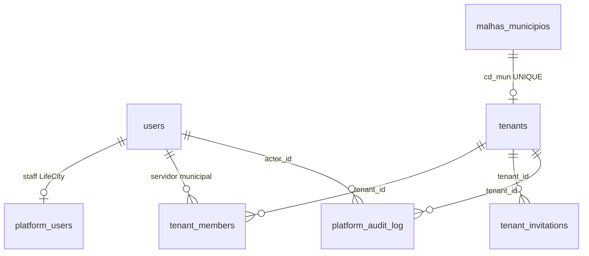

# ADR-005 — Gestão de plataforma: clientes (prefeituras) e staff LifeCity

| Campo | Valor |
|-------|-------|
| **Status** | Proposto |
| **Data** | 2026-06-11 |
| **Decisores** | Equipe LifeCity |
| **Relacionado** | [ADR-001](ADR-001-multi-tenant-municipal.md) · [ADR-003](ADR-003-gestao-operacional-ocorrencias.md) · [ADR-004](ADR-004-comunicacao-cidadao-prefeitura.md) |
| **Contrato** | [Fase 6 — Platform Admin](../contracts/phase-6-platform-admin.md) |

---

## 1. Contexto

O LifeCity opera hoje com **um cliente piloto** (Campinas) e um painel municipal completo (`/admin/*`): dashboard, inbox, workflow, equipes ops, SLA, moderação e chat cidadão. Cidadãos usam o app Flutter; servidores municipais usam o admin-web com RBAC via `tenant_members`.

A camada **multi-tenant municipal** ([ADR-001](ADR-001-multi-tenant-municipal.md)) prevê `public.tenants` como ambiente contratado 1:1 com `cd_mun`, mas **CRUD de tenants foi explicitamente excluído** da Fase 2 — onboarding de novas prefeituras é feito via SQL manual (`006`, `008`, `018`).

### Estado atual (inventário — jun/2026)

| Camada | Situação |
|--------|----------|
| **Supabase prod** | 1 tenant (`campinas`, status `trial`); 8 `tenant_members`; 213 complaints; 59 municípios com bairros em `malhas` |
| **Backend** | `/api/admin/*` tenant-scoped; JWT com `tenantId`, `cd_mun`, `tenantRole`; **sem** `/api/platform/*` |
| **admin-web** | Painel municipal em `/admin/*`; gate `user_level > 1` (só frontend); **sem** rotas `/platform/*` |
| **Identidade LifeCity** | **Não existe** — staff usa `user_level > 1` + SQL manual para `tenant_members` |
| **Config geográfica** | `cityValidator.js` lê **env global** (`CITY_CEP_PREFIXES`, `CITY_LAT_*`) — impede multi-cidade real |
| **Status do tenant** | Cidadãos bloqueados se `suspended` (`resolveLocation`); **admin municipal ainda acessa** |
| **Gestão de membros** | `GET /admin/tenant-members` (read-only); convites = SQL manual |

### Problema

A LifeCity (desenvolvedores/donos) não consegue, pelo produto:

1. **Cadastrar** novas prefeituras como clientes.
2. **Convidar** o primeiro gestor municipal e gerenciar equipe do painel.
3. **Suspender/reativar** um cliente e refletir isso em todo o ecossistema.
4. **Observar** métricas cross-tenant (KPIs, saúde, cobertura de malhas).
5. **Dar suporte** entrando no ambiente municipal com rastreabilidade.

Hoje isso exige acesso direto ao banco e conhecimento de migrations — inviável para escalar comercialmente.

### Distinção crítica: três tipos de usuário

| Tipo | Vínculo | Acesso | Papel |
|------|---------|--------|-------|
| **Cidadão** | `users` (`user_level = 1`) | App Flutter | Registrar ocorrências, social |
| **Servidor municipal** | `tenant_members` | admin-web `/admin/*` | Operar o município contratado |
| **Staff LifeCity** | `platform_users` *(novo)* | admin-web `/platform/*` | Gerir clientes e plataforma |

**Nunca confundir** `tenant_members.role = 'admin'` (gestor municipal) com staff da plataforma.

---

## 2. Objetivos

1. Introduzir identidade **staff LifeCity** separada de `tenant_members`.
2. Entregar namespace `/api/platform/*` para CRUD de clientes (tenants) e gestão de membros municipais.
3. Entregar ambiente **`/platform/*`** no mesmo admin-web, visualmente distinto do painel municipal.
4. Automatizar **onboarding** de novo município (tenant + seed ops/SLA + convite owner).
5. Permitir **impersonation** auditada — staff entra no `/admin/*` de qualquer tenant para suporte.
6. Migrar config geográfica para **`tenants.settings`** (multi-cidade).
7. **Deprecar** `users.user_level` como gate de acesso; membership explícita passa a ser fonte da verdade.
8. Manter **retrocompatibilidade** com app Flutter e APIs cidadão existentes.
9. Entregar **estimativa comercial** no onboarding (MVP de billing — sem faturamento).

## 3. Não-objetivos (escopo deste ADR)

- Faturamento, cobrança recorrente, NF e integração de pagamento (gateway, boleto).
- Self-service para prefeituras criarem o próprio tenant.
- SSO gov.br ou login federado.
- App mobile para staff LifeCity.
- RLS Supabase tenant-aware (continua via middleware backend).
- CRUD de malhas IBGE pelo painel (import continua via scripts/`ogr2ogr`).
- Separação em app web distinto — **mesmo admin-web**, ambientes diferentes.
- Alterações obrigatórias no app Flutter (exceto consumo indireto de `tenants.settings` via backend).

---

## 4. Personas

| Persona | Papel (`platform_users.role`) | Necessidade principal |
|---------|--------------------------------|------------------------|
| **Admin LifeCity** | `admin` | CRUD clientes, suspender, convidar gestores, impersonation |
| **Operador LifeCity** | `operator` | Onboarding assistido, suporte, métricas, impersonation |
| **Visualizador LifeCity** | `viewer` | Dashboard global read-only, health dos clientes |

Fluxo típico de onboarding:

```
Admin LifeCity → Wizard: seleciona município (malhas.municipios)
              → Define slug, status trial, settings (CEP, bounds)
              → Estimativa comercial (população → valor mensal/contrato)
              → Backend cria tenant + seed ops/SLA
              → Convida gestor: conta criada + link para definir senha
              → Staff repassa link (WhatsApp/e-mail pessoal) se SMTP indisponível
              → Gestor define senha → acessa /admin/*
              → Cidadãos passam a ver cidade como disponível no app
```

---

## 5. Decisões arquiteturais

### D-001 — Tabela `platform_users` separada de `tenant_members`

Staff LifeCity é vínculo distinto:

```sql
platform_users (user_id → users.id, role platform_role, is_active)
```

Um mesmo `users.id` **pode** ter ambos os vínculos (útil para demos), mas papéis são independentes.

### D-002 — Enum `platform_role`

| Papel | Rank | Capacidades |
|-------|------|-------------|
| `viewer` | 0 | Listar tenants, health, audit log (read-only) |
| `operator` | 1 | Criar tenant, convidar membros, impersonation |
| `admin` | 2 | Suspender/reativar, alterar settings, promover platform staff |

Ranking análogo a `requireTenantRole` — middleware `requirePlatformRole(minRole)`.

### D-003 — JWT unificado com claims opcionais

Access token carrega:

```json
{
  "userId": "uuid",
  "platformRole": "admin",
  "tenantId": "uuid",
  "cd_mun": "3509502",
  "tenantRole": "admin",
  "impersonating": false
}
```

Regras:
- `/api/platform/*` exige `platformRole` + membership ativa em `platform_users`.
- `/api/admin/*` exige `tenantId` + `tenantRole` + membership ativa em `tenant_members` **ou** impersonation válida (D-007).
- Login único (`POST /api/auth/login`); response inclui `platformRole` (se houver) + `tenants[]` (se houver).

### D-004 — Mesmo admin-web, dois ambientes de UI

| Prefixo | Layout | Público |
|---------|--------|---------|
| `/platform/*` | `PlatformLayout` (identidade LifeCity) | Staff LifeCity |
| `/admin/*` | `AdminLayout` (existente) | Servidores municipais + impersonation |

Roteamento pós-login:
- Só `platformRole` → `/platform`
- Só `tenant_members` → `/admin`
- Ambos → `/platform` (default staff) com link "Entrar em município"

### D-005 — Config geográfica por tenant em `tenants.settings`

Substituir env global por settings por cliente:

```json
{
  "geo": {
    "cep_prefixes": ["130", "1310"],
    "bounds": {
      "lat_min": -23.15,
      "lat_max": -22.65,
      "lng_min": -47.40,
      "lng_max": -46.90
    }
  },
  "features": {
    "chat_enabled": true,
    "missions_enabled": false
  },
  "billing": {
    "population": 1224527,
    "population_source": "utb_demografia",
    "base_monthly_brl": 2000,
    "infra_monthly_brl": 350,
    "total_monthly_brl": 2350,
    "contract_months": 24,
    "total_contract_brl": 56400,
    "estimated_at": "2026-06-11T12:00:00.000Z"
  }
}
```

`cityValidator.js` passa a resolver config via `cd_mun` ou `tenant_id`. Env global permanece como **fallback** para Campinas durante transição.

### D-006 — Enforcement de `tenants.status`

| Status | App cidadão | Admin municipal | Platform |
|--------|-------------|-----------------|----------|
| `trial` | Permitido | Permitido | — |
| `active` | Permitido | Permitido | — |
| `suspended` | Bloqueado (`resolveLocation`) | **Bloqueado** (403) | Permitido (staff) |

`requireTenantMember` passa a checar `tenants.status IN ('trial', 'active')`, exceto quando `impersonating = true`.

### D-007 — Impersonation auditada

Staff com `platformRole ≥ operator` pode `POST /api/platform/tenants/:id/enter`:
- Emite JWT com `tenantId`, `tenantRole: 'admin'`, `impersonating: true`
- **Não** cria linha em `tenant_members`
- Toda ação gera registro em `platform_audit_log`
- admin-web exibe banner persistente "Modo suporte — {displayName}"
- `POST /api/platform/exit-impersonation` restaura JWT platform-only

### D-008 — Convites municipais: conta pré-criada + link para definir senha

Ao convidar um gestor municipal (`POST /platform/tenants/:id/members/invite`):

1. **Conta criada imediatamente** se o e-mail não existir em `users` — senha aleatória (nunca comunicada).
2. **`tenant_members` inserido** na hora com a role do convite.
3. **`tenant_invitations`** registra token (hash SHA-256) para **troca de senha** — expiração 7 dias (`NOW() + INTERVAL`).
4. Gestor acessa `/accept-invite?token=...` e **apenas define senha própria** (nome editável se conta nova).
5. Após definir senha → login automático → `/admin/*`.

Se o e-mail **já existe** em `users`: apenas insere `tenant_members`; sem troca de senha; staff informa o gestor para login normal.

**Papel `owner`:** sem funções exclusivas em relação a `admin` (rank ≥ admin nas rotas existentes).

### D-008b — E-mail opcional; link copiável como caminho principal (MVP)

Não há e-mail institucional (Hostgator etc.) no MVP. Estratégia:

| Caminho | Quando | Comportamento |
|---------|--------|---------------|
| **Link na UI** | Sempre | Response + tela exibem `setupLink` com botão "Copiar link"; staff envia manualmente (WhatsApp, Gmail pessoal, presencial) |
| **E-mail automático** | Opcional | Se `EMAIL_USER` + `EMAIL_PASS` configurados (mesma infra do reset de senha), tenta enviar; **falha não bloqueia** o convite |

O convite **nunca depende** de SMTP para existir — conta e membership já estão no banco.

### D-009 — Estimativa comercial no onboarding (MVP billing)

Sem cobrança integrada. Ao cadastrar cliente, wizard calcula e persiste em `tenants.settings.billing`:

- **População:** `SUM(tot_pop)` de `malhas.utb_demografia` por `cd_mun` quando disponível; senão input manual no wizard.
- **Assinatura base (mercado B2G):** tier por faixa populacional — referência R$ 1.000–2.000/mês para cidades médias (~100k–500k hab.).
- **Infra estimada:** custo mensal de nuvem + tráfego (Supabase, storage, FCM, egress) somado à base.
- **Contrato:** staff escolhe **12, 24 ou 36 meses**; UI exibe valor/mês e **total do contrato**.

Valores são **indicativos** para proposta comercial — não geram fatura.

Fórmula detalhada: contrato Fase 6 §12.

### D-010 — Onboarding seed automático

Ao criar tenant via platform, backend executa (transação):
1. `INSERT tenants`
2. Seed ops teams + SLA (template de `018_seed_campinas_ops.sql`, parametrizado)
3. Opcional: convite gestor (conta + link senha)

Verificação de malhas: response inclui `coverage.bairrosLoaded`, `coverage.setoresLoaded` para o `cd_mun`.

### D-011 — Deprecar `users.user_level`

| Fase | Ação |
|------|------|
| 6a–6d | `user_level` ignorado em código novo; gate admin-web migra para `platformRole \|\| tenants.length > 0` |
| Pós-6e | Migration remove dependência; coluna mantida nullable para histórico |

Backend passa a rejeitar login admin-web se user não tem `platform_users` **nem** `tenant_members` ativos.

### D-012 — Staff LifeCity inicial (seed)

Migration manual `027_seed_platform_staff.sql` vincula **admin** platform:

| E-mail | `platform_role` |
|--------|-----------------|
| `lucasgiazzi@gmail.com` | `admin` |
| `bernardo.wiemer333@gmail.com` | `admin` |

Pré-requisito: linhas correspondentes em `users` (cadastro prévio no app ou INSERT na migration).

### D-013 — Audit log cross-tenant

Tabela `platform_audit_log`:
- `actor_id`, `action`, `target_type`, `target_id`, `tenant_id` (nullable), `payload` jsonb, `created_at`
- Ações: `tenant.create`, `tenant.update`, `tenant.suspend`, `member.invite`, `member.role_change`, `impersonation.start`, `impersonation.end`

Retenção: sem purge automático no MVP.

---

## 6. Modelo de dados (novo)



### Tabelas novas

```sql
-- Staff LifeCity
public.platform_users (
  id uuid PK,
  user_id uuid UNIQUE → users.id,
  role platform_role ENUM (viewer|operator|admin),
  is_active boolean,
  created_at timestamptz
)

-- Convites: token para definir senha (conta já criada)
public.tenant_invitations (
  id uuid PK,
  tenant_id uuid → tenants.id,
  user_id uuid → users.id,          -- conta pré-criada ou existente
  email text,
  role tenant_role,
  token_hash text,
  invited_by uuid → users.id,
  expires_at timestamptz,
  accepted_at timestamptz,            -- preenchido ao definir senha (ou ao confirmar user existente)
  created_at timestamptz
)

-- Audit trail staff
public.platform_audit_log (
  id uuid PK,
  actor_id uuid → users.id,
  action text,
  target_type text,
  target_id text,
  tenant_id uuid → tenants.id NULL,
  payload jsonb,
  created_at timestamptz
)
```

### Alterações em tabelas existentes

Nenhuma coluna nova em `tenants` — `settings` jsonb já existe (D-005).

---

## 7. Fases de implementação

```
Fase 6a ──► Fase 6b ──► Fase 6c ──► Fase 6d ──► Fase 6e
 Schema+Auth  API Tenants  API Members  UI Platform  Geo+Status
```

| Sub-fase | Entrega | Contrato |
|----------|---------|----------|
| **6a** | Migrations + JWT claims + middleware platform | §6–§7 |
| **6b** | CRUD tenants + onboarding seed + health | §8 |
| **6c** | Convites + CRUD tenant_members + audit log | §9 |
| **6d** | admin-web `/platform/*` + impersonation UI | §10 |
| **6e** | `cityValidator` multi-tenant + enforcement status | §11 |

Detalhamento completo: [phase-6-platform-admin.md](../contracts/phase-6-platform-admin.md).

---

## 8. Segurança

| Regra | Implementação |
|-------|---------------|
| Isolamento platform vs. municipal | Middlewares distintos; rotas separadas |
| Impersonation rastreável | `platform_audit_log` + banner UI |
| Convites | Conta pré-criada; token só para senha; link copiável na UI |
| E-mail | Opcional (`EMAIL_USER`/`EMAIL_PASS`); falha SMTP não bloqueia convite |
| Timestamps | `NOW() + INTERVAL` no SQL — nunca `Date` JS (armadilha ADR-001) |
| MCP Supabase | DDL via `backend/migrations/` — não via MCP |
| Secrets | Seed inicial de `platform_users` via migration revisável ou script manual |

---

## 9. Tenant piloto e transição

Campinas permanece tenant piloto. Migration de transição:
1. Inserir staff LifeCity em `platform_users` (`lucasgiazzi@gmail.com`, `bernardo.wiemer333@gmail.com`)
2. Migrar `settings` de Campinas a partir de env atual
3. Manter `tenant_members` existentes inalterados

---

## 10. Riscos e mitigações

| Risco | Mitigação |
|-------|-----------|
| Confusão admin municipal vs. platform | Nomes distintos (`platformRole` vs `tenantRole`); UI com badges |
| Malhas incompletas para novo município | Wizard avisa cobertura; dashboard municipal funciona parcialmente |
| `user_level` legado quebra login | Período de transição; gate dual no frontend |
| Impersonation sem audit | Bloquear impersonation se log falhar |
| Env global vs. settings | Fallback env durante 6e; remover depois |
| SMTP indisponível | Link copiável na UI; convite funciona sem e-mail |

---

## 11. Glossário

| Termo | Definição |
|-------|-----------|
| **Cliente** | Prefeitura contratante = registro em `tenants` |
| **Staff LifeCity** | Desenvolvedores/donos com acesso `platform_users` |
| **Impersonation** | Staff opera `/admin/*` de um tenant sem membership real |
| **Onboarding** | Fluxo de criação de tenant + seed + convite owner |

---

## 12. Referências internas

- Multi-tenant municipal: [ADR-001](ADR-001-multi-tenant-municipal.md)
- Seed ops Campinas: `backend/migrations/018_seed_campinas_ops.sql`
- Auth: `backend/src/controllers/authController.js`, `backend/src/services/tenantService.js`
- admin-web auth: `admin-web/src/auth/`
- Validação geo: `backend/src/infra/cityValidator.js`
